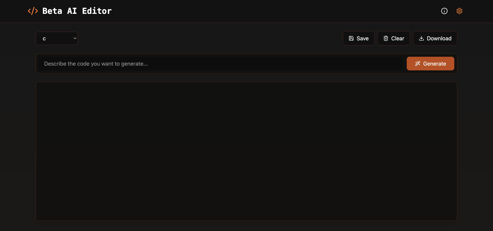

# Beta AI Editor

   



## Summary
Beta AI Editor allows AI-powered code generation and editing but has potential security concerns related to API key exposure and unauthorized data access.

## Details
Beta AI Editor integrates Google Generative AI, providing intelligent code suggestions. However, improper API key handling and insufficient request validation may lead to data exposure. The application does not enforce strict origin policies, potentially allowing unauthorized requests to access AI-generated content.

Example risk points:
- API keys stored in client-side code without encryption.
- No rate limiting on AI requests, allowing potential abuse.
- Lack of strict CORS settings, exposing the API to cross-origin requests.
- AI-generated responses may include sensitive or unintended data.

## Attack Scenario
1. An attacker hosts a malicious web page (`http://malicious.example.com`).
2. A user visits the malicious site while logged into Beta AI Editor.
3. The malicious site executes `fetch('http://127.0.0.1:3000/api/generate')`, bypassing insufficient CORS restrictions.
4. The attacker gains access to AI-generated code responses.
5. If API keys are exposed in the client, the attacker can make direct API requests.

Additionally, attackers can:
- Fetch `/history`: if recent AI generations are stored without authentication.
- Access `/docs`: if documentation files reveal API structures.
- Exploit `/assets`: if the directory listing is enabled.

## PoC (Proof of Concept)
1. Clone the repository.
2. Run `npm install` and start with `npm run dev`.
3. Open browser console on another website and run:
   ```js
   fetch('http://127.0.0.1:3000/api/generate').then(r => r.text()).then(console.log);
   ```
4. If CORS is not restricted, the response will contain AI-generated content.

## Impact
Users of Beta AI Editor might unknowingly expose their AI-generated code and API keys due to improper security measures. Attackers can:
- Extract sensitive business logic or intellectual property.
- Abuse AI request endpoints for free API usage.
- Leak AI-generated data to unauthorized third parties.

## Mitigation Suggestions
- Implement strict CORS policies.
- Store API keys securely using environment variables.
- Introduce authentication for API endpoints.
- Enable rate limiting to prevent abuse.

## Data Privacy Policy
We take your data privacy seriously. Here is a summary of our data privacy policy:
- **Data Collection**: We collect personal information such as your name, email address, and usage data.
- **Data Usage**: Your data is used to provide and improve our services, communicate with you, and ensure security.
- **Data Storage**: We store your data securely and retain it only as long as necessary.
- **User Rights**: You have the right to access, correct, delete, and object to the processing of your data.

For more details, please refer to our [Data Privacy Policy](docs/data_privacy_policy.md).

## Dependabot Configuration
We have integrated Dependabot to help manage our dependencies and keep them up-to-date. Dependabot automatically checks for updates to the dependencies defined in our `package.json` and `package-lock.json` files.

### Benefits of Using Dependabot
- **Automated Dependency Updates**: Dependabot regularly checks for updates to your dependencies and creates pull requests to keep them up-to-date.
- **Security Alerts**: Dependabot alerts you to security vulnerabilities in your dependencies and provides fixes.
- **Improved Code Quality**: By keeping dependencies up-to-date, you ensure that your project benefits from the latest features, bug fixes, and performance improvements.

## License
This project is licensed under the MIT License. See the [LICENSE](LICENSE) file for more details.
